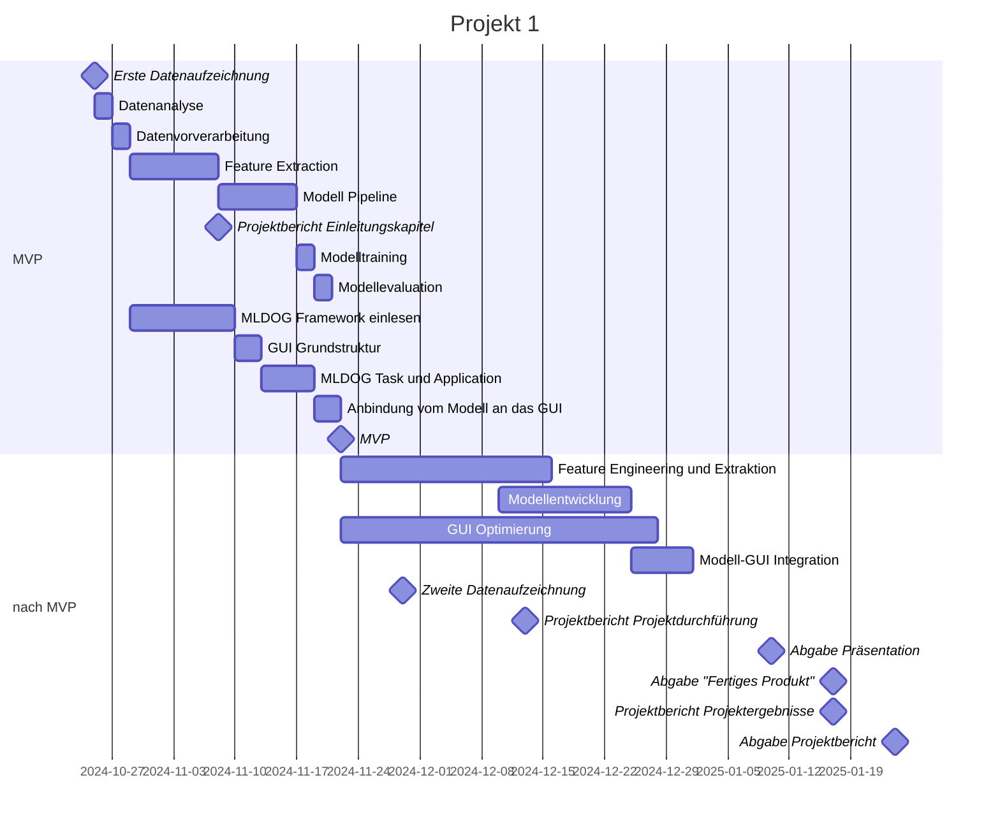

```mermaid
gantt
title Projekt 1
dateFormat DD-MM-YY
section MVP
Erste Datenaufzeichnung :milestone, 25-10-24,
Datenanalyse :a1, 25-10-24 , 2d
Datenvorverarbeitung :a2, after a1 , 2d
Feature Extraction :a3, after a2 , 10d
Modell Pipeline :a4, after a3 , 9d
Projektbericht Einleitungskapitel :milestone, 08-11-24,
Modelltraining :a5, after a4 , 2d
Modellevaluation :a6, after a5 , 2d
MLDOG Framework einlesen : a8, after a2, 12d
GUI Grundstruktur : a9, after a8, 3d
MLDOG Task und Application : a10, after a9, 6d
Anbindung vom Modell an das GUI : a11, after a10, 3d
MVP :milestone, 22-11-24,

section nach MVP

Feature Engineering und Extraktion :b1, 22-11-24, 24d
Modellentwicklung :b2, 10-12-24, 15d
GUI Optimierung :b3, 22-11-24, 36d
Modell-GUI Integration :b4, after b2, 7d

Zweite Datenaufzeichnung :milestone, 29-11-24,
Projektbericht Projektdurchführung :milestone, 13-12-24,
Abgabe Präsentation :milestone, 10-01-25,
Abgabe "Fertiges Produkt" :milestone, 17-01-25,
Projektbericht Projektergebnisse :milestone, 17-01-25,
Abgabe Projektbericht :milestone, 24-01-25,
```
