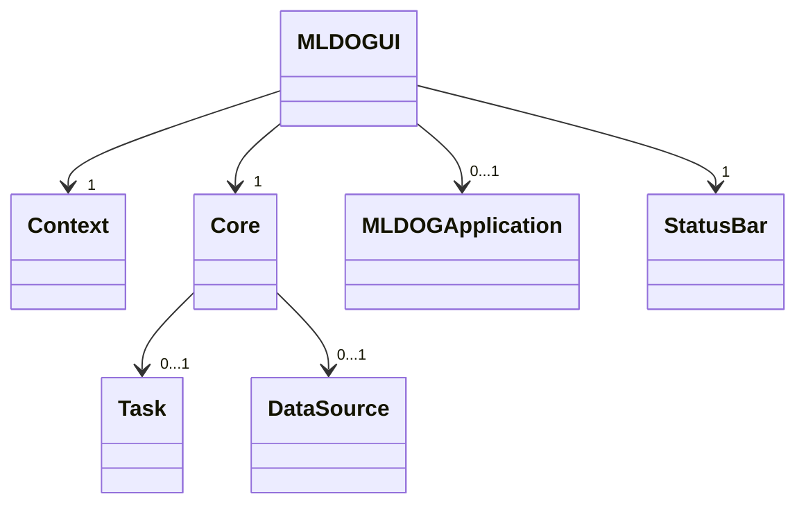
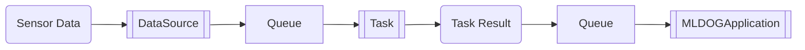

# MLDOG Application Framework

The Machine Learning Demonstrator Offenburg (MLDOG) application is a GUI application written in [Python tkinter](https://docs.python.org/3/library/tkinter.html) for demonstrating various machine learning applications based on real-time sensor data.

## Architecture

The MLDOG Application consists of two central components - the `DataSource` and the `Task` - managed by an application runtime environment - the `Core`.
On top of that, a simple GUI (`MLDOGUI`) provides controls for selecting and configuring various data sources and presents a specific user-defined (machine learning) application (`MLDOGApplication`).



- `DataSource`:  
  The `DataSource` - as its name suggests - is the source for (live) sensor data within the application.
  The origin of the actual sensor data (network, file, etc.) is encapsulated in the data source instance.
  Once set up, a data source provides an common API for starting and stopping measurements.
  Incoming sensor data is forwarded via a Python Queue to the active `Task`.
- `Task`:  
  The `Task` represents the user-defined (machine learning) task.
  It receives sensor data from the data source (via the before mentioned Python Queue), applies arbitrary processing steps (e.g. performing a classification) and forwards the results to a second Python Queue for displaying in the active `MLDOGApplication`.
- `MLDOGApplication`:  
  An `MLDOGApplication` represents an user-defined (machine learning) application.
  It is responsible for managing the problem-specific application workflow, e.g. activating appropriate tasks and handling (displaying) the corresponding task results.
  The active `MLDOGApplication` is embedded within the main application GUI and has access to the main application model - the `Core` - for managing tasks as well as data sources.
- `Core`:  
  The `Core` component is responsible for managing and executing the active data source and task instance within the application.
  Each data source and task runs in a separate thread managed by the application core.
- `MLDOGUI`:  
  Top-level GUI component of the application.
  It provides the common menu structure for controlling data sources and sub-application instances as well as a simple status bar for displaying status information of the active data source instance.
- `Wizard`:  
  Base class for GUI dialogs using the application core.

Available components (data source generators and applications) are registered to a `MLDOGContext` object, which is provided to the application at startup.
Currently, there exists an example domain - the `DefaultDrillContext` - which provides a collection of data sources and demo applications for the drill context.

The following flowchart illustrates the data flow within the application:



First, a chunk of sensor data is received by the `DataSource` and forwarded to the input-`Queue` of the active `Task` instance.
The active `Task` then continuously processes incoming data chunks within its queue and publishes corresponding results via its output-`Queue`.
These results may then be visualized by the active `MLDOGApplication`, which created the `Task` in the first place.

## Running the Application

Simply construct a context object with your specific components, forward it to a new `MLDOGUI` instance and call its `run()` method.

```python
...
if __name__ == '__main__':
    # construct a new context instance
    context = DefaultDrillContext()
    context.registerDataSourceWizard(MyDataSourceWizard, 'My Data Source')
    ...

    context.registerApplication(MyApplication, 'My Application')
    ...

    # run GUI for context
    ui = MLDOGUI(context)
    ui.run()
```

See [DrillOG.py](../DrillOG.py) in the parent directory for an example.

## Creating a New MLDOGApplication

To create a new problem-specific `MLDOGApplication` simply extend the `MLDOGApplication` class and implement a constructor that receives the main application model and the application container frame as parameters:

```python
class MyApplication(MLDOGApplication):
    ...
    def __init__(self, core: Core, parent: tk.Frame):
        MLDOGApplication.__init__(self, 'My Application', core, parent)

        # TODO: add application-specific UI components
        self._ui = ...
```

Within the application constructor, you can create an arbitrary UI component structure that suits your specific application needs.
The only requirement it that the root UI component is set as the `_ui` attribute of your `MLDOGApplication` subclass.
This root component is then automatically integrated into the main GUI when the application is activated.

Note: You need to register your application to the context object before running the GUI in order to be available.

For example application implementations please take a look at the demo applications in the [app/plugins](app/plugins/) directory.

## Creating a New Task

To create a new `Task` simply extend the `Task` class and implement the `process(...)` method.

The management of the input- and output-Queues of a task is encapsulated by the parent `Task` class and abstracted to the child class by the `process(...)` and `publishResult(...)` methods.  
Incoming sensor data is forwarded to the `process(...)` method.
Outgoing task results are published by calling the `publishResult(...)` method.
All data processing (data accumulation, feature extraction, classification, etc.) is expected to happen within the `process(...)` method (as this method is called within a separate thread).

```python
class DemoTask(Task):
    ...
    def __init__(self):
        super().__init__('Demonstration')
    
    def process(self, data: np.ndarray) -> None:
        # TODO: process incoming data block 
        result = ...

        # publish result
        self.publishResult(result)
```

Tasks do not need to be registration within the `MLDOGContext` object, as they are created on demand within an problem-specific application definition.

For example task implementations please take a look at existing tasks in the [app/tasks](app/tasks/) directory.

## Creating a New DataSource

TODO

## Creating a New Data Source Wizard

TODO

## Extracting Events from Live Data

The application is designed to allow for real-time processing and visualization of the live data stream within a user-defined application.
However, not all tasks are intended to provide real-time processing of the incoming data stream.
Instead, a task-specific processing may be triggered by certain events in the data stream, e.g. the end of a whole drilling procedure.
In such a case, a detector component is required, which extracts such task-specific events from the live data stream.
